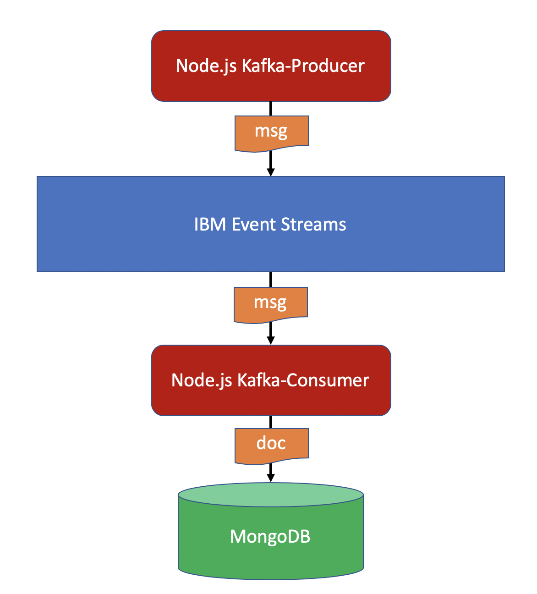

# IBM Event Streams for IBM Cloud Kafka Node.js console sample application with MongoDB integration
This Node.js console application demonstrates how to connect to [IBM Event Streams for IBM Cloud](https://cloud.ibm.com/docs/services/EventStreams?topic=eventstreams-getting_started), send and receive messages using the [node-rdkafka](https://github.com/Blizzard/node-rdkafka) module. It also shows how to create topics using the Kafka Admin API as exposed by `node-rdkafka`. In addition, the consumer component of the application can be configured to store the messages received into a MongoDB database. The diagram below depicts the architecture overview of the application components.

This application is based on the [kafka-nodejs-console-sample](https://github.com/ibm-messaging/event-streams-samples/tree/master/kafka-nodejs-console-sample) in the [events-streams-samples](https://github.com/ibm-messaging/event-streams-samples) for the IBM Event Streams service on IBM Cloud. The features added to [kafka-nodejs-console-sample](https://github.com/ibm-messaging/event-streams-samples/tree/master/kafka-nodejs-console-sample) are as follows:

1. You can specify the messaging behaviour of the application using the environment variable `TYPE`. If `TYPE` is set to `consumer`, the application will only act as a message consumer. If `TYPE` is set to `producer`, the application will only act as a message producer. If `TYPE` is set to `both`, the application will act as both a producer and consumer of messages. By default, the application acts as both a producer and consumer of messages.
2. If you provide a valid MongoDB connection URL in the environment variable `MONGO_URL`, the consumer component connects to the MongoDB database and stores the messages received into a collection named `messages`.
3. You can specify the Kafka Consumer Client ID for the consumer component using the environment variable `CONSUMER_CLIENT_ID`. The default value is `kafka-nodejs-console-sample-consumer`.
4. You can specify the Kafka Consumer Group ID for the consumer component using the environment variable `CONSUMER_GROUP_ID`. The default value is `kafka-nodejs-console-sample-group`.

__Important Note__: This sample creates a topic with one partition on your behalf. On the Classic and Standard plan of IBM Event Steams, this will incur a fee if the topic does not already exist.

## Running the application

The application can be run in the [Red Hat OpenShift Cluster on IBM Cloud](./docs/Kubernetes_Service.md).
